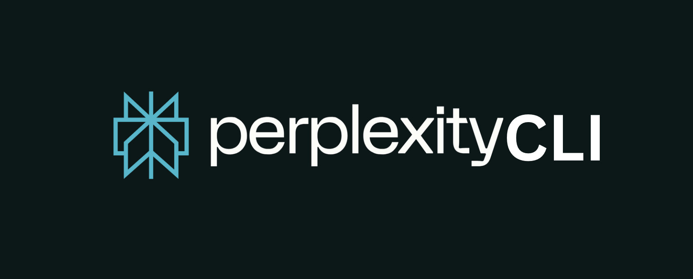

# PerplexityCLI

A powerful command-line interface for querying the Perplexity API, enabling rapid information retrieval and Python code analysis directly from your terminal.

**Author**: Giovanny Espitia



## Overview

Perplexity-CLI (`qp.py`) is a terminal-based tool designed to streamline research and code debugging. With seamless integration with the Perplexity API, it allows users to:
- Search for information without leaving the terminal.
- Analyze Python files for bugs and optimization opportunities.

This tool is ideal for developers, researchers, and anyone who values efficiency in their workflow.

## Getting Started

Follow these steps to set up Perplexity-CLI on your system:

1. **Install Dependencies**:
   - Create a Conda environment using the provided configuration:
     ```bash
     conda env create -f environment.yml
     ```
   - Activate the environment:
     ```bash
     conda activate <env_name>
     ```

2. **Update the Shebang Line**:
   - Find the path to your Conda environment’s Python interpreter:
     ```bash
     which python
     ```
   - Replace the shebang line in `qp.py` (e.g., `#!/opt/bin/python`) with this path.

3. **Configure API Key and Budget**:
   - Open `qp.py` and update:
     - `API_KEY`: Your Perplexity API key.
     - `BUDGET`: Your Perplexity credits in USD.

4. **Make the Script Executable**:
   - Grant execute permissions:
     ```bash
     chmod +x qp.py
     ```

5. **Add to PATH for Global Access**:
   - Move `qp.py` to `/usr/local/bin` for system-wide use:
     ```bash
     sudo mv qp.py /usr/local/bin/qp
     ```
   - If `/usr/local/bin` doesn’t exist, create it:
     ```bash
     sudo mkdir -p /usr/local/bin
     ```
   - Alternatively, set an alias in your shell config (e.g., `.bashrc`, `.zshrc`):
     ```bash
     echo 'alias qp="python /path/to/qp.py"' >> ~/.zshrc
     source ~/.zshrc
     ```

## Functionality

<video src="./docs/assets/demo.mp4" controls></video>

Perplexity-CLI offers two primary features:

- **Information Retrieval**:
  - Query the Perplexity API directly from the terminal for fast, accurate answers.
  - Ideal for research, quick fact-checking, or exploring topics without a browser.

- **Code Analysis**:
  - Analyze Python files for bugs, errors, or inefficiencies.
  - Receive detailed fixes for issues or suggestions to optimize performance, readability, and maintainability.

## Usage

Run `qp` without arguments to view the command-line argument structure:

```bash
qp
```

### Command-Line Arguments

| Argument     | Type            | Description                                                                 | Default                     |
|--------------|-----------------|-----------------------------------------------------------------------------|-----------------------------|
| `prompt`     | String (multiple) | Your query or question for the Perplexity API (wrap in quotes for multi-word input). | None (optional if `--file` is used) |
| `--model`    | String          | The Perplexity model to use (e.g., `sonar-pro`, `sonar-deep-research`).      | `sonar-pro`                 |
| `--verbose`  | Flag (boolean)  | Enable detailed, verbose responses with explanations and context.            | `False`                     |
| `--copy-code`| Flag (boolean)  | Copy code blocks from the response to the clipboard (requires `pyperclip`).  | `False`                     |
| `--file`     | String          | Path to a Python file to analyze for bugs and optimization.                  | None (optional)             |

### Examples

- **Query Information**:
  ```bash
  qp "latest AI news" --verbose
  ```
  Retrieves a detailed response about recent AI developments.

- **Debug a Python File**:
  ```bash
  qp --file mycode.py --copy-code
  ```
  Analyzes `mycode.py` for bugs, suggests fixes, and copies any provided code to the clipboard.

- **Combined Usage**:
  ```bash
  qp "explain this code" --file mycode.py --verbose
  ```
  Explains the code in `mycode.py` with detailed analysis.

- **View Argument Structure**:
  ```bash
  qp
  ```
  Displays a table of available arguments and exits.

## Notes

- **Dependencies**: Ensure `requests`, `rich`, and `pyperclip` are installed via the `environment.yml` file.
- **API Key**: Obtain your Perplexity API key from the Perplexity dashboard.
- **Cost Tracking**: The script tracks API usage costs based on token counts and model pricing (June 2025 rates).
- **Terminal Support**: Use a modern terminal (e.g., iTerm2, Windows Terminal) for clickable URLs in the output.

## Contributing

Contributions are welcome! Please:
- Fork the repository.
- Submit a pull request with clear descriptions of your changes.
- Report issues or suggest features via GitHub Issues.

## License

This project is open-source and available under the [MIT License](LICENSE).

---

**Created by Giovanny Espitia**  
Happy querying and debugging! 🚀
